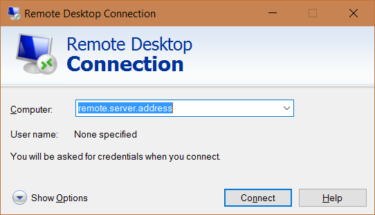

# RDP Protocol Handler
This simple app allows you to use `rdp://` uri to start remote desktop session. So you can use uri like this:

`rdp://remote.server.address`

and you will see Remote Desktop Connection window if you do not have saved credentials, otherwise you will be automatically connected.

## How to install
Place the `.exe` file in desired location on your PC, then run it **as administrator** with `/install` parameter like this:

`rdpProtocoleHandler.exe /install`

After installation do not move the `.exe` file to other location. When you change the file location the protocol handler will not work until you run it again with `/install` parameter.

## How to use
Just open uri which start with `rdp://` using browser or any other way.

### Uri format
The uri format used by application is as following:

`rdp://<remote.server.address>,<param1>,<param2>,...`

Each parameter in the uri is separated by comma `,`. First parameter is always the remote server address. Other parameters are exactly the same which mstsc.exe use (except the rdp file path). To see all parameters for mstsc.exe run following command:

`mstsc /?`

#### Examples
Run Remote Desktop with specific window width and high

`rdp://remote.server.address,/w:600,/h:400`

Run Remote Desktop using all monitors

`rdp://remote.server.address,/multimon`

## RDP Protocol Handler parameters
`rdpProtocoleHandler.exe [/install] [/uninstall] [/log] [/help] [/?]`

Parameter       | Description
 -------------- | ------------- 
 /install       | Run the installation procedure and register the rdp uri handler. **Require administration privileges**
 /uninstall     | Run the uninstallation procedure and unregister the rdp uri handler. **Require administration privileges**
 /log           | Open the log file
 /help          | Open the help
 /?             | Open the help

#### Examples
Install rdp uri handler

`rdpProtocoleHandler.exe /install`

Uninstall rdp uri handler

`rdpProtocoleHandler.exe /uninstall`

## Log file
The app logs its usages to file using [NLog](http://nlog-project.org). By default, log file is created in `C:\Users\<currentUser>\AppData\Local\Temp\rdppotocolhandler-logs`. You can change the logging behavior by creating the NLog.config file (for details go to NLog documentation). 
